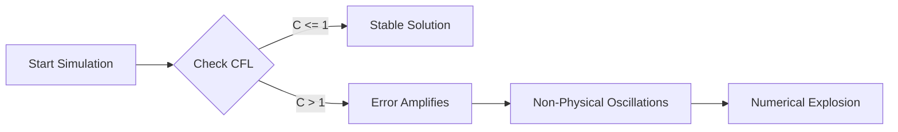

## **Introduction**

In the progression of Part 4, **Elliptic PDEs** (Chapter 10) gave us static equilibrium, and **Parabolic PDEs** (Chapter 11) modeled **diffusion**—systems that dissipate energy and smooth out irregularities over time. This chapter introduces **Hyperbolic PDEs**, which govern **wave phenomena**, a distinct class of motion characterized by the propagation and **retention** of energy and shape through space [4, 5].

**Physical Examples of Wave Propagation:**

  * **Mechanical Vibrations** (e.g., a guitar string or drum head).
  * **Electromagnetism** (e.g., light propagation).
  * **Fluid Dynamics** (e.g., surface ripples).

The classic example is the **1D Wave Equation** for displacement $y(x, t)$:

$$
\frac{\partial^2 y}{\partial t^2} = v^2 \frac{\partial^2 y}{\partial x^2}
$$

The crucial difference from the Parabolic PDE is the **second-order time derivative** ($\frac{\partial^2 y}{\partial t^2}$). This drives **oscillatory** and **non-dissipative** motion, contrasting with the diffusive nature of the Heat Equation ($\frac{\partial T}{\partial t}$).

Since the equation is second-order in time (structurally similar to Newton's Second Law), **two initial conditions** are required to fully specify the system's starting state:

1.  **Initial Position (Displacement):** The shape of the string at $t=0$, $y(x, 0)$.
2.  **Initial Velocity (Speed):** The instantaneous velocity profile at $t=0$, $\frac{\partial y}{\partial t} (x, 0)$.

## **Chapter Outline**

| Sec. | Title | Core Ideas & Examples |
| :--- | :--- | :--- |
| **12.1** | The FTCS "Verlet" Scheme | Discretizing $\frac{\partial^2 y}{\partial t^2}$ and $\frac{\partial^2 y}{\partial x^2}$, recurrence relation. |
| **12.2** | The CFL Stability Condition | Courant Number $C = v h_t / h_x$, $C \le 1$ constraint. |
| **12.3** | The "First Step" Problem | Handling the $y_{i, -1}$ term, using initial velocity. |
| **12.4** | Application: Plucked String | Dirichlet BCs, standing waves, harmonics. |
| **12.5** | Summary & Bridge | Parabolic vs. Hyperbolic, bridge to Linear Algebra. |

-----

## **12.1 Method 1: The "Verlet" of PDEs (The FTCS Algorithm)**

The solution involves applying the **Finite Difference Method (FDM)** to discretize both the second-order time and spatial derivatives. This results in the **Forward-Time Centered-Space (FTCS) scheme**, which is the preferred explicit marching method.

-----

### **The Recurrence Relation**

Applying the $\mathcal{O}(h^2)$ **Central Difference stencil** (Chapter 5) to both the time and spatial derivatives, and then rearranging the resulting expression to solve for the future displacement $y_{i, n+1}$, yields the explicit recurrence relation [1]:

$$
y_{i, n+1} = 2y_{i, n} - y_{i, n-1} + C^2 \left[ y_{i+1, n} - 2y_{i, n} + y_{i-1, n} \right]
$$

where $C$ is the **Courant Number**, $C = \frac{v h_t}{h_x}$.

```pseudo-code
Algorithm: FTCS for 1D Wave Equation (Main Loop)

# (Assumes y_present (n) and y_past (n-1) are known)
Initialize: C = v * h_t / h_x
C_squared = C * C

for i = 1 to N-2: # (Iterate over interior points)
    # Calculate spatial curvature (Laplacian)
    laplacian_y = y_present[i+1] - 2*y_present[i] + y_present[i-1]
    
    # Apply the "Verlet" recurrence relation
    y_future[i] = 2*y_present[i] - y_past[i] + C_squared * laplacian_y
    
end for

# (Boundaries y_future[0] and y_future[N-1] are set by BCs)
```

---

### **The Connection to the Verlet Algorithm**

This formula is **structurally identical to the Verlet algorithm** (Chapter 8).

??? question "Why is this 'Verlet-like'?"
    Look at the structure. $y_{i, n+1}$ (future) depends on $2y_{i, n}$ (present) and $-y_{i, n-1}$ (past). This is the *exact* time-stepping form of the Verlet algorithm from Chapter 8. The term $C^2 (\dots)$ is just the discrete form of $h^2 a(t)$, where the acceleration is provided by the *spatial curvature* (the tension in the string).

    This equivalence confirms the scheme is fundamentally **structure-preserving**, a necessary feature for modeling conservative wave motion.

---

## **12.2 The "Speed Limit": The CFL Stability Condition**

The explicit FTCS scheme for the Wave Equation is **conditionally stable**, meaning stability requires satisfying a critical constraint known as the **CFL condition** [1, 2, 3].

---

### **The CFL Condition**

Stability is governed by the dimensionless **Courant Number ($C$)**, which is the ratio of the physical wave speed ($v$) to the numerical speed ($h_x/h_t$):

$$
C = \frac{v h_t}{h_x}
$$

The rigorous stability requirement is:

$$
\mathbf{C} = \frac{v h_t}{h_x} \le 1
$$

---

### **Physical Meaning**

!!! tip "The Physical Meaning of the CFL Condition"
    The **Courant–Friedrichs–Lewy (CFL) condition** is a numerical "speed limit." It dictates that the *numerical* speed of information ($h_x / h_t$) must be faster than the *physical* speed of the wave ($v$).

    If $C > 1$, the physical wave "jumps over" a grid point in a single time step. The numerical algorithm literally cannot see this information, so it becomes unstable and "explodes."
    

If $C > 1$, the simulation rapidly produces **non-physical, high-frequency oscillations** that grow exponentially, leading to a numerical explosion.



The constraint leads to a linear cost restriction: $h_t \le \frac{h_x}{v}$. This is less severe than the quadratic restriction found in the Parabolic PDE's FTCS scheme, but it still forces the time step to be linearly reduced with any increase in spatial resolution.

---

## **12.3 The "First Step" Problem**

The FTCS recurrence relation is a **three-level scheme**, requiring displacement values at three time levels ($n-1, n, n+1$). Since we only have the state at $t=0$ ($n=0$), the past state $y_{i, -1}$ is missing, preventing the direct execution of the main loop.

---

### **The Solution**

A special one-time formula must be derived to generate $y_{i, 1}$ from the known initial conditions $y_{i, 0}$ and the initial velocity $v_{i, 0}$ [5]:

1. The **initial velocity** $v_{i, 0}$ is approximated using a **Central Difference** in time: $v_{i, 0} \approx \frac{y_{i, 1} - y_{i, -1}}{2 h_t}$.

2. The resulting expression for $y_{i, -1}$ is substituted into the general FTCS recurrence relation at $n=0$.

3. Solving for $y_{i, 1}$ yields the special formula for the first time step:

$$
\boxed{y_{i, 1} = y_{i, 0} + h_t v_{i, 0} + \frac{C^2}{2} \left( y_{i+1, 0} - 2y_{i, 0} + y_{i-1, 0} \right)}
$$

The simulation proceeds by executing this special initialization step, then transitioning to the general FTCS formula for all steps where $n \ge 1$.

---

## **12.4 Core Application: The "Plucked" Guitar String**

The **Plucked Guitar String** is the classic application, modeling a string fixed at both ends (Dirichlet BCs, $y(0, t) = y(L, t) = 0$) and released from rest ($v(x, 0) = 0$) with an initial displacement (a triangular shape) [4].

---

### **The Strategy**

The simulation executes the two-stage time march with a stable Courant Number ($C \le 1.0$). Since the initial velocity is zero, the "First Step" formula simplifies: $y_{i, 1} = y_{i, 0} + \frac{C^2}{2} (\text{Laplacian})$. The resulting motion demonstrates **wave superposition** and the formation of **standing wave patterns** (harmonics) as the initial displacement propagates and reflects off the fixed boundaries.

!!! example "Visualizing Wave Harmonics"

    When the simulation runs, the initial triangular pulse (a superposition of many frequencies) splits into two pulses traveling in opposite directions. As they reflect off the fixed boundaries, they interfere. Over time, the simulation shows a stable superposition of the fundamental mode and its **standing wave harmonics**, just as a real guitar string does.


---

## **12.5 Chapter Summary and Bridge to Part 5: Linear Algebra**

This chapter established the full solver for the **Hyperbolic PDE** (Wave Equation).

| PDE Type                          | Time Derivative Order                        | FDM Scheme             | Stability     | Final Constraint                                        |
| :-------------------------------- | :------------------------------------------- | :--------------------- | :------------ | :------------------------------------------------------ |
| **Parabolic (Diffusion)** (Ch 11) | First ($\frac{\partial T}{\partial t}$)      | Crank-Nicolson         | Unconditional | Matrix Solve $\mathbf{A} \mathbf{T}_{n+1} = \mathbf{b}$ |
| **Hyperbolic (Wave)** (Ch 12)     | Second ($\frac{\partial^2 y}{\partial t^2}$) | Explicit FTCS (Verlet) | Conditional   | $\mathbf{C} \le 1$                                      |

The FDM, through Part 4, has consistently led to the core requirement: **solving systems of linear equations** [1, 4].

* **Implicit PDEs (Ch 11):** Required solving a tridiagonal system at every time step.
* **BVPs (Ch 9):** Required solving $\mathbf{A} \mathbf{y} = \mathbf{b}$.

We now shift focus from **discretization** to **solution**. **Part 5: Linear Algebra** will build the core algorithms (like the Thomas Algorithm, or LU Decomposition from Chapter 13) required to efficiently solve the massive, sparse matrix systems generated by the FDM.

---

## **References**

[1] Press, W. H., Teukolsky, S. A., Vetterling, W. T., & Flannery, B. P. (2007). *Numerical Recipes: The Art of Scientific Computing* (3rd ed.). Cambridge University Press.

[2] Higham, N.J. (2002). *Accuracy and Stability of Numerical Algorithms*. SIAM.

[3] Quarteroni, A., Sacco, R., & Saleri, F. (2007). *Numerical Mathematics*. Springer.

[4] Newman, M. (2013). *Computational Physics*. CreateSpace Independent Publishing Platform.

[5] Garcia, A. L. (2000). *Numerical Methods for Physics* (2nd ed.). Prentice Hall.

[6] Thijssen, J. M. (2007). *Computational Physics* (2nd ed.). Cambridge University Press.

