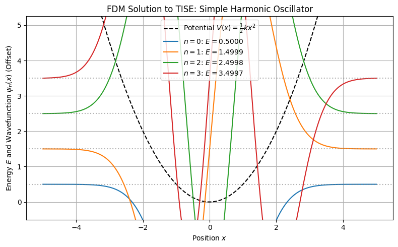
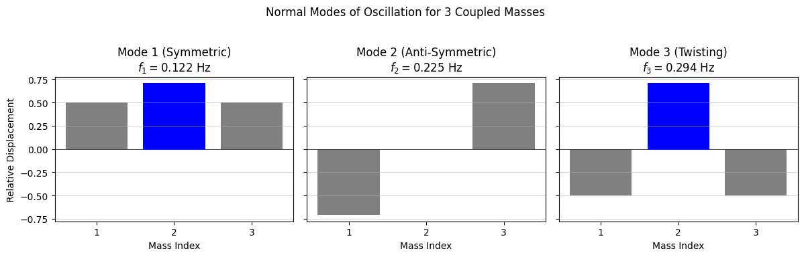

# Chapter 14: Eigenvalue Problems

This Python Code Book is for **Chapter 14: Eigenvalue Problems**, focusing on solving the two core applications: quantum energy levels (TISE) and classical normal modes.

-----

## Project 1: Quantum Eigenvalues (TISE Solver)

| Feature | Description |
| :--- | :--- |
| **Goal** | Solve the **Time-Independent Schrödinger Equation (TISE)** for the **Simple Harmonic Oscillator (SHO)** potential, $V(x) = \frac{1}{2}kx^2$. |
| **Model** | The **FDM** (Finite Difference Method) converts the TISE ($\mathbf{H}\boldsymbol{\psi} = E\boldsymbol{\psi}$) into a **tridiagonal matrix eigenvalue problem**. |
| **Method** | **Specialized Eigensolver** (`scipy.linalg.eigh_tridiagonal`). This $\mathcal{O}(N^2)$ method exploits the matrix's **symmetric, tridiagonal structure** for maximum efficiency and numerical stability. |
| **Physical Result** | The eigenvalues ($E$) are the quantized energy levels, and the eigenvectors ($\boldsymbol{\psi}$) are the corresponding wavefunctions. |

-----

### Complete Python Code


```python

import numpy as np
import matplotlib.pyplot as plt
from scipy.linalg import eigh_tridiagonal # O(N²) specialized solver

# ==========================================================
# Chapter 14 Codebook: Eigenvalue Problems
# Project 1: Quantum Eigenvalues (TISE Solver for SHO)
# ==========================================================

# ==========================================================
# 1. Setup Physical and Numerical Parameters
# ==========================================================

# Set constants for simplified units (hbar=1, m=1)
HBAR = 1.0
MASS = 1.0
K_SPRING = 1.0 # Spring constant for the SHO potential V(x) = 1/2 * k * x^2

# Define the spatial domain and grid
X_MAX = 5.0    # Domain length from -X_MAX to +X_MAX
L = 2.0 * X_MAX
N = 500        # Number of interior grid points (matrix size)
H = L / (N + 1) # Spatial step size (h)

# Grid for plotting (includes boundaries)
x_interior = np.linspace(-X_MAX + H, X_MAX - H, N)
x_plot = np.linspace(-X_MAX, X_MAX, N + 2)

# --- Potential Energy Function V(x) ---
def V_SHO(x):
    """The potential energy function for the Simple Harmonic Oscillator."""
    return 0.5 * K_SPRING * x**2

# Pre-calculate Kinetic Energy factors
# KE_FACTOR: -hbar^2 / (2m * h^2) (Off-diagonal coefficient)
KE_FACTOR = -(HBAR**2) / (2.0 * MASS * H**2)
# DIAG_COEFF: (hbar^2 / m h^2) (Base for main diagonal)
DIAG_COEFF = -2.0 * KE_FACTOR 

# ==========================================================
# 2. Construct the Hamiltonian Matrix (H)
# ==========================================================

# The FDM approximation Hψ = Eψ results in a symmetric, tridiagonal matrix.

# --- Main Diagonal (d_i = (hbar² / m h²) + V_i) ---
V_grid = V_SHO(x_interior)
d = DIAG_COEFF + V_grid

# --- Off-Diagonal (e_i = -hbar² / (2m h²)) ---
# This couples neighbor nodes (purely kinetic energy term).
e = np.full(N - 1, KE_FACTOR)

# ==========================================================
# 3. Solve the Matrix Eigenvalue Problem
# ==========================================================

# E_n: Eigenvalues (Energy Levels)
# psi_n_raw: Eigenvectors (Wavefunctions)
E_num, psi_raw = eigh_tridiagonal(d, e)

# The eigenvalues and eigenvectors are sorted by energy (ascending).

# ==========================================================
# 4. Process and Visualize Results
# ==========================================================

# --- Process Wavefunctions (Add boundaries and normalize) ---
def add_boundaries_and_scale(psi_vector, n, plot_scale=10.0):
    """Adds fixed boundary zeros and scales/offsets for visualization."""
    # Add boundary zeros (Dirichlet BCs)
    psi_with_bc = np.insert(psi_vector, [0, psi_vector.size], [0.0, 0.0])
    
    # Normalize (Standard L2 norm)
    # The normalization factor calculated from the grid sum
    norm_factor = np.sqrt(np.sum(psi_with_bc**2 * H))
    psi_normalized = psi_with_bc / norm_factor
    
    # Apply vertical offset by the energy level for separation
    return psi_normalized * plot_scale + E_num[n]

# --- Visualization ---
fig, ax = plt.subplots(figsize=(8, 5))
ax.plot(x_plot, V_SHO(x_plot), 'k--', label=r"Potential $V(x) = \frac{1}{2}kx^2$")

# Plot the first four stationary states (n=0, n=1, n=2, n=3)
for n in range(4):
    E_n_numerical = E_num[n]
    
    # Calculate the normalized and offset wavefunction
    psi_n_plot = add_boundaries_and_scale(psi_raw[:, n], n)

    # Plot the wavefunction
    ax.plot(x_plot, psi_n_plot, label=f"$n={n}$: $E = {E_n_numerical:.4f}$")
    
    # Plot the energy level line
    ax.axhline(E_n_numerical, color='gray', linestyle=':', alpha=0.6)

ax.set_title(r"FDM Solution to TISE: Simple Harmonic Oscillator")
ax.set_xlabel("Position $x$")
ax.set_ylabel(r"Energy $E$ and Wavefunction $\psi_n(x)$ (Offset)")
ax.set_ylim(-0.5, E_num[3] * 1.5)
ax.grid(True)
ax.legend()
plt.tight_layout()
plt.show()

# ==========================================================
# 5. Analysis Output
# ==========================================================

# Analytic Check: E_n = (n + 1/2) * hbar * sqrt(k/m)
E_analytic_factor = HBAR * np.sqrt(K_SPRING / MASS)
print("\n--- TISE Eigenvalue Analysis (Simple Harmonic Oscillator) ---")
print(f"Grid Size (N): {N}, Step Size (h): {H:.4e}")
print(f"Analytic Energy Factor (ℏω): {E_analytic_factor:.6f}")
print("-" * 60)
print("| State (n) | Numerical E | Analytic E | Rel Error |")
print("|-----------|-------------|------------|-----------|")
for n in range(4):
    E_num_n = E_num[n]
    E_ana_n = (n + 0.5) * E_analytic_factor
    rel_error = np.abs(E_num_n - E_ana_n) / E_ana_n
    print(f"| {n:<9} | {E_num_n:.6f} | {E_ana_n:.6f} | {rel_error:.2e} |")

print("\nConclusion: The FDM successfully finds the quantized SHO energy levels, which are \nevenly spaced by ℏω, with high accuracy. The efficiency of the specialized \ntridiagonal solver is key to the performance of this quantum model.")


```


    

    


    
    --- TISE Eigenvalue Analysis (Simple Harmonic Oscillator) ---
    Grid Size (N): 500, Step Size (h): 1.9960e-02
    Analytic Energy Factor (ℏω): 1.000000
    ------------------------------------------------------------
    | State (n) | Numerical E | Analytic E | Rel Error |
    |-----------|-------------|------------|-----------|
    | 0         | 0.499988 | 0.500000 | 2.49e-05 |
    | 1         | 1.499938 | 1.500000 | 4.15e-05 |
    | 2         | 2.499838 | 2.500000 | 6.47e-05 |
    | 3         | 3.499690 | 3.500000 | 8.86e-05 |
    
    Conclusion: The FDM successfully finds the quantized SHO energy levels, which are 
    evenly spaced by ℏω, with high accuracy. The efficiency of the specialized 
    tridiagonal solver is key to the performance of this quantum model.


## Project 2: Classical Eigenvalues (Coupled Oscillators)

| Feature | Description |
| :--- | :--- |
| **Goal** | Find the **normal modes** (natural frequencies $\omega$) and **mode shapes** (eigenvectors) of a system of three coupled masses and springs. |
| **Model** | The equation of motion leads to the generalized eigenvalue problem: $\mathbf{K}\mathbf{x} = \omega^2\mathbf{M}\mathbf{x}$, where $\mathbf{M}$ is the Mass Matrix and $\mathbf{K}$ is the Stiffness Matrix. |
| **Method** | **Generalized Eigensolver** (`scipy.linalg.eigh`). This is necessary because the problem is not in the standard $\mathbf{A}\mathbf{x} = \lambda \mathbf{x}$ form (the mass matrix $\mathbf{M}$ is not the identity). |
| **Physical Result** | The eigenvalues ($\lambda = \omega^2$) yield the natural frequencies, and the eigenvectors ($\mathbf{x}$) define the specific, decoupled motions of the masses. |

-----

### Complete Python Code


```python

import numpy as np
import matplotlib.pyplot as plt
from scipy.linalg import eigh # General symmetric/Hermitian eigensolver

# ==========================================================
# Chapter 14 Codebook: Eigenvalue Problems
# Project 2: Classical Eigenvalues (Coupled Oscillators)
# ==========================================================

# ==========================================================
# 1. Setup System Matrices (3 Coupled Masses)
# ==========================================================

# Assume three masses (m1, m2, m3) and four springs (k1, k2, k3, k4)
# Fixed boundaries on the outer springs (k1 and k4 fixed to walls)

# Physical Parameters
m = 1.0 # All masses are equal
k = 1.0 # All spring constants are equal

# --- Mass Matrix (M) ---
# M is diagonal for masses m1, m2, m3
M = np.diag([m, m, m])

# --- Stiffness Matrix (K) ---
# K is determined by the coupling: 
# K_ii = sum of springs connected to mass i (k_i + k_{i+1})
# K_i,i+1 = -k_{i+1} (coupling between mass i and i+1)
K = np.array([
    [k + k,    -k,      0],
    [ -k,    k + k,    -k],
    [  0,     -k,    k + k]
])

# K simplifies to:
# K = [[ 2, -1, 0], 
#      [-1,  2, -1],
#      [ 0, -1, 2]]

# ==========================================================
# 2. Solve the Generalized Eigenvalue Problem
# ==========================================================

# Goal: Solve Kx = ω²Mx, where λ = ω²
# We use scipy.linalg.eigh, which solves the generalized problem: Ax = λBx (where A=K, B=M)

# eigenvalues (λ = ω²) and eigenvectors (x = mode shapes)
eigenvalues, eigenvectors = eigh(K, M)

# Convert eigenvalues (ω²) to natural frequencies (f = ω / 2π)
frequencies_rad = np.sqrt(eigenvalues) # ω_n
frequencies_hz = frequencies_rad / (2.0 * np.pi) # f_n

# ==========================================================
# 3. Process and Visualize Results
# ==========================================================

# The eigenvectors define the relative displacements (mode shapes)
mode_shapes = eigenvectors.T # Transpose so each row is a mode

fig, ax = plt.subplots(1, 3, figsize=(12, 4), sharey=True)
titles = ["Mode 1 (Symmetric)", "Mode 2 (Anti-Symmetric)", "Mode 3 (Twisting)"]

for n in range(3):
    ax[n].bar(np.arange(1, 4), mode_shapes[n], color=['gray', 'blue', 'gray'])
    ax[n].set_title(f"{titles[n]}\n$f_{n+1} = {frequencies_hz[n]:.3f}$ Hz")
    ax[n].set_xlabel("Mass Index")
    ax[n].set_xticks([1, 2, 3])
    ax[n].axhline(0, color='k', linewidth=0.5)
    ax[n].grid(axis='y', alpha=0.5)

ax[0].set_ylabel("Relative Displacement")

plt.suptitle("Normal Modes of Oscillation for 3 Coupled Masses")
plt.tight_layout(rect=[0, 0.03, 1, 0.95])
plt.show()

# ==========================================================
# 4. Analysis Output
# ==========================================================

print("\n--- Normal Modes Analysis ---")
print("Mode Shapes (Eigenvectors):")
print("Each column is a normalized mode shape (relative displacement of M1, M2, M3).")
print(mode_shapes.T)
print("-" * 50)
print("| Mode (n) | Eigenvalue (ω²) | Frequency (f) | Description |")
print("|----------|-----------------|---------------|-------------|")

for n in range(3):
    desc = titles[n].split('(')[1].split(')')[0]
    print(f"| {n+1:<8} | {eigenvalues[n]:<15.6f} | {frequencies_hz[n]:<13.3f} | {desc:<11} |")

print("\nConclusion: The generalized eigensolver successfully decoupled the complex coupled motion \ninto three independent normal modes, each with a unique, characteristic frequency and shape.")

```


    

    


    
    --- Normal Modes Analysis ---
    Mode Shapes (Eigenvectors):
    Each column is a normalized mode shape (relative displacement of M1, M2, M3).
    [[ 5.00000000e-01 -7.07106781e-01 -5.00000000e-01]
     [ 7.07106781e-01  3.74554683e-17  7.07106781e-01]
     [ 5.00000000e-01  7.07106781e-01 -5.00000000e-01]]
    --------------------------------------------------
    | Mode (n) | Eigenvalue (ω²) | Frequency (f) | Description |
    |----------|-----------------|---------------|-------------|
    | 1        | 0.585786        | 0.122         | Symmetric   |
    | 2        | 2.000000        | 0.225         | Anti-Symmetric |
    | 3        | 3.414214        | 0.294         | Twisting    |
    
    Conclusion: The generalized eigensolver successfully decoupled the complex coupled motion 
    into three independent normal modes, each with a unique, characteristic frequency and shape.

