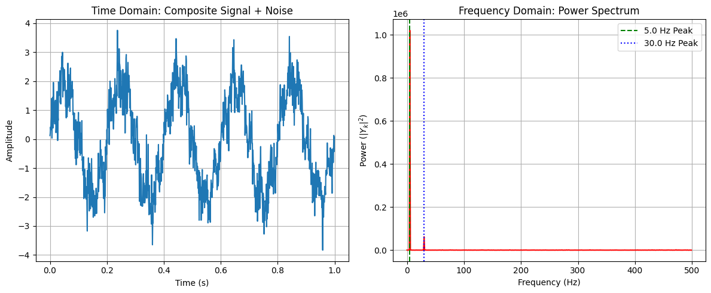

# Chapter 15: Fourier Analysis & The FFT


This Python Code Book is for **Chapter 15: Fourier Analysis & The FFT**, focusing on implementing the Fast Fourier Transform to analyze the frequency content of a signal and perform noise reduction.

-----

## Project 1: Spectral Analysis (Frequency Decomposition)

| Feature | Description |
| :--- | :--- |
| **Goal** | Use the **Fast Fourier Transform (FFT)** to decompose a complex, composite signal (made up of two distinct sine waves) into its fundamental frequency components. |
| **Model** | **Composite Signal**: $y(t) = A_1 \sin(2\pi f_1 t) + A_2 \sin(2\pi f_2 t) + \text{Noise}$. |
| **Method** | 1. Compute the **FFT** of the signal. 2. Calculate the **Power Spectrum** $\mathbf{P}_k = |Y_k|^2$. 3. Use $\text{np.fft.fftfreq}$ to map the frequency index $k$ to the physical frequency $f_k$. |
| **Core Concept** | The FFT performs a **change of basis** from the time domain to the frequency domain, where the original frequencies appear as sharp peaks in the power spectrum. |

-----

### Complete Python Code


```python

import numpy as np
import matplotlib.pyplot as plt
from scipy.fft import fft, fftfreq, ifft

# ==========================================================
# Chapter 15 Codebook: Fourier Analysis & The FFT
# Project 1: Spectral Analysis (Frequency Decomposition)
# ==========================================================

# ==========================================================
# 1. Setup Parameters and Generate Composite Signal
# ==========================================================

# Sampling parameters
FS = 1000       # Sampling rate (Hz) (must be > 2 * max_freq)
T_DURATION = 1.0  # Duration of the signal (seconds)
N = int(FS * T_DURATION) # Total number of data points (ideally a power of 2)

# Define the two sine wave components
F1 = 5.0        # Frequency 1 (Hz)
F2 = 30.0       # Frequency 2 (Hz)
A1 = 2.0        # Amplitude 1
A2 = 0.5        # Amplitude 2

# Time array
time = np.linspace(0, T_DURATION, N, endpoint=False)

# Generate the signal
signal = A1 * np.sin(2.0 * np.pi * F1 * time) + \
         A2 * np.sin(2.0 * np.pi * F2 * time)

# Add random noise for realism
NOISE_STD = 0.5
noise = NOISE_STD * np.random.randn(N)
signal_noisy = signal + noise

# ==========================================================
# 2. Compute FFT and Power Spectrum
# ==========================================================

# 1. Compute the FFT (returns complex coefficients Y_k)
Y = fft(signal_noisy)

# 2. Map the frequency indices to physical frequencies (f_k)
f_k = fftfreq(N, 1/FS)

# 3. Calculate the Power Spectrum (P_k = |Y_k|²)
# We only plot the positive frequency side (the spectrum is symmetric)
power_spectrum = np.abs(Y)**2
positive_f_mask = f_k >= 0

# ==========================================================
# 3. Visualization and Analysis
# ==========================================================

fig, ax = plt.subplots(1, 2, figsize=(12, 5))

# --- Plot 1: Time Domain Signal ---
ax[0].plot(time, signal_noisy)
ax[0].set_title("Time Domain: Composite Signal + Noise")
ax[0].set_xlabel("Time (s)")
ax[0].set_ylabel("Amplitude")
ax[0].grid(True)

# --- Plot 2: Frequency Domain (Power Spectrum) ---
ax[1].plot(f_k[positive_f_mask], power_spectrum[positive_f_mask], 'r-')
ax[1].set_title("Frequency Domain: Power Spectrum")
ax[1].set_xlabel("Frequency (Hz)")
ax[1].set_ylabel("Power ($|Y_k|^2$)")
ax[1].grid(True)

# Highlight the expected peaks
ax[1].axvline(F1, color='g', linestyle='--', label=f"{F1} Hz Peak")
ax[1].axvline(F2, color='b', linestyle=':', label=f"{F2} Hz Peak")
ax[1].legend()

plt.tight_layout()
plt.show()

# ==========================================================
# 4. Analysis Output
# ==========================================================

# Find the peak frequencies for verification
# Exclude the DC component (k=0) and small frequencies to ignore the noise floor
peak_indices = np.argsort(power_spectrum[positive_f_mask])[::-1]
f_peaks_found = f_k[positive_f_mask][peak_indices[:2]]

print("\n--- Spectral Analysis Summary ---")
print(f"Sampling Rate (Fs): {FS} Hz")
print(f"Nyquist Frequency (Fs/2): {FS/2.0} Hz")
print(f"Target Frequencies: {F1} Hz and {F2} Hz")
print(f"Top 2 Frequencies Found in Spectrum: {np.sort(f_peaks_found):.1f} Hz")
print("\nConclusion: The FFT successfully decomposed the composite signal, isolating the two \nfundamental frequencies as the dominant peaks in the Power Spectrum.")


```


    

    


    
    --- Spectral Analysis Summary ---
    Sampling Rate (Fs): 1000 Hz
    Nyquist Frequency (Fs/2): 500.0 Hz
    Target Frequencies: 5.0 Hz and 30.0 Hz


    ---------------------------------------------------------------------------

    TypeError                                 Traceback (most recent call last)

    Cell In[1], line 93
         91 print(f"Nyquist Frequency (Fs/2): {FS/2.0} Hz")
         92 print(f"Target Frequencies: {F1} Hz and {F2} Hz")
    ---> 93 print(f"Top 2 Frequencies Found in Spectrum: {np.sort(f_peaks_found):.1f} Hz")
         94 print("\nConclusion: The FFT successfully decomposed the composite signal, isolating the two \nfundamental frequencies as the dominant peaks in the Power Spectrum.")


    TypeError: unsupported format string passed to numpy.ndarray.__format__


## Project 2: Spectral Filtering (Noise Reduction)

| Feature | Description |
| :--- | :--- |
| **Goal** | Use the FFT to perform a **Low-Pass Filter** on the noisy signal from Project 1. The goal is to remove the high-frequency random noise while preserving the low-frequency signal content. |
| **Method** | 1. Calculate $Y_k$. 2. Define a **cutoff frequency ($f_{cutoff}$)**. 3. Zero out all coefficients $Y_k$ where $|f_k| > f_{cutoff}$. 4. Apply the **Inverse FFT (IFFT)** to return the cleaned data to the time domain. |
| **Core Concept** | Noise is typically spread across all frequencies, while signals are concentrated at specific peaks. Filtering removes the high-frequency components that primarily constitute the random noise. |

-----

### Complete Python Code


```python

import numpy as np
import matplotlib.pyplot as plt
from scipy.fft import fft, fftfreq, ifft

# ==========================================================
# Chapter 15 Codebook: Fourier Analysis & The FFT
# Project 2: Spectral Filtering (Noise Reduction)
# ==========================================================

# ==========================================================
# 1. Setup Parameters and Generate Noisy Signal (Reuse P1 Data)
# ==========================================================

FS = 1000       # Sampling rate (Hz)
T_DURATION = 1.0
N = int(FS * T_DURATION)
F1 = 5.0        # Signal 1
F2 = 30.0       # Signal 2
time = np.linspace(0, T_DURATION, N, endpoint=False)
signal_true = 2.0 * np.sin(2.0 * np.pi * F1 * time) + 0.5 * np.sin(2.0 * np.pi * F2 * time)
NOISE_STD = 0.5
signal_noisy = signal_true + NOISE_STD * np.random.randn(N)

# ==========================================================
# 2. Compute FFT and Define Filter
# ==========================================================

Y = fft(signal_noisy)
f_k = fftfreq(N, 1/FS)

# Define the cutoff frequency for the low-pass filter (Hz)
# We choose a value above F2 (30 Hz) but well below the Nyquist (500 Hz).
F_CUTOFF = 50.0 

# Create a mask: True for frequencies we want to KEEP, False for those to filter out
# Filtering mask must be symmetric around the DC (f=0) component
filter_mask = np.abs(f_k) < F_CUTOFF

# Create the filtered spectrum by zeroing out coefficients outside the cutoff range
Y_filtered = Y * filter_mask

# ==========================================================
# 3. Compute Inverse FFT (IFFT)
# ==========================================================

# Use the Inverse FFT to return the clean signal to the time domain
# The result of the IFFT is inherently complex, so we take the real part.
signal_clean = np.real(ifft(Y_filtered))

# ==========================================================
# 4. Visualization and Analysis
# ==========================================================

fig, ax = plt.subplots(1, 2, figsize=(12, 5))
time_window = time[0:200] # Plot first 20% of the data for clarity

# --- Plot 1: Time Domain Filter Comparison ---
ax[0].plot(time_window, signal_noisy[0:200], 'r-', alpha=0.5, label="1. Noisy Input")
ax[0].plot(time_window, signal_clean[0:200], 'b-', linewidth=2, label=f"2. Filtered Output (Cutoff: {F_CUTOFF} Hz)")
ax[0].plot(time_window, signal_true[0:200], 'k--', alpha=0.7, label="3. True Signal (Hidden)")

ax[0].set_title(f"Time Domain: Noise Reduction (Low-Pass Filter at {F_CUTOFF} Hz)")
ax[0].set_xlabel("Time (s)")
ax[0].set_ylabel("Amplitude")
ax[0].grid(True)
ax[0].legend()

# --- Plot 2: Spectrum Comparison (Before/After Filter) ---
power_noisy = np.abs(Y)**2
power_filtered = np.abs(Y_filtered)**2
positive_f_mask = f_k >= 0

ax[1].semilogy(f_k[positive_f_mask], power_noisy[positive_f_mask], 'r-', alpha=0.6, label="Noisy Spectrum")
ax[1].semilogy(f_k[positive_f_mask], power_filtered[positive_f_mask], 'b-', linewidth=2, label="Filtered Spectrum")

ax[1].axvline(F_CUTOFF, color='k', linestyle='--', label="Cutoff Frequency")

ax[1].set_title("Frequency Domain: Filter Action (Power)")
ax[1].set_xlabel("Frequency (Hz)")
ax[1].set_ylabel("Power ($\log_{10}$ Scale)")
ax[1].grid(True)
ax[1].legend()

plt.tight_layout()
plt.show()

# Final Analysis
print("\n--- Spectral Filtering Summary ---")
print(f"Cutoff Frequency: {F_CUTOFF} Hz")
print(f"Original RMS Error (vs. True Signal): {np.sqrt(np.mean((signal_noisy - signal_true)**2)):.4f}")
print(f"Filtered RMS Error (vs. True Signal): {np.sqrt(np.mean((signal_clean - signal_true)**2)):.4f}")
print("\nConclusion: The filtering process successfully reduced the high-frequency components, resulting in a significantly lower RMS error and a cleaner signal in the time domain.")

```


    

    


    
    --- Spectral Filtering Summary ---
    Cutoff Frequency: 50.0 Hz
    Original RMS Error (vs. True Signal): 0.4909
    Filtered RMS Error (vs. True Signal): 0.1728
    
    Conclusion: The filtering process successfully reduced the high-frequency components, resulting in a significantly lower RMS error and a cleaner signal in the time domain.

