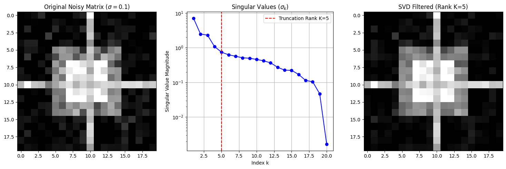

# Chapter 16: Data-Driven Analysis: SVD & PCA

---

## Project 1: Principal Component Analysis (PCA) on Data

| Feature | Description |
| :--- | :--- |
| **Goal** | Apply **Principal Component Analysis (PCA)** to a synthetic, high-dimensional dataset (representing observations of three coupled variables) to find the **principal components** and visualize the data in a reduced 2D space. |
| **Method** | 1. **Center** the data. 2. Calculate the **Covariance Matrix**. 3. Solve the **Eigenvalue Problem** on the covariance matrix to obtain eigenvalues (variance) and eigenvectors (Principal Components). |
| **Core Concept** | PCA is a specialized application of the **Eigenvalue Problem (Chapter 14)** to data analysis, finding the new orthogonal axes that capture maximum variance. |

-----

### Complete Python Code


```python

import numpy as np
import matplotlib.pyplot as plt
from scipy.linalg import eigh

# ==========================================================
# Chapter 16 Codebook: SVD & PCA
# Project 1: Principal Component Analysis (PCA) on Data
# ==========================================================

# ==========================================================
# 1. Generate Synthetic Data
# ==========================================================
# Data represents 500 observations of 3 coupled variables (dimensions)
N_OBSERVATIONS = 500
N_DIMENSIONS = 3

# Create correlated data: Data is primarily aligned along PC1 and PC2.
rng = np.random.default_rng(42)
z = rng.normal(size=(N_OBSERVATIONS, 3)) # Base Gaussian data

# Create transformation matrix to induce correlation and variance
# This matrix ensures that variance is dominated by the first two components
T = np.array([
    [10.0, 1.0, 0.5], # PC1: High variance
    [1.0, 5.0, 0.5],  # PC2: Medium variance
    [0.5, 0.5, 1.0]   # PC3: Low variance (mostly noise)
])
X = z @ T # X is the final 500x3 high-dimensional data matrix

# ==========================================================
# 2. PCA Step 1: Centering the Data
# ==========================================================
# Center the data by subtracting the mean of each column
X_mean = np.mean(X, axis=0)
X_centered = X - X_mean

# ==========================================================
# 3. PCA Step 2: Calculate Covariance Matrix (C)
# ==========================================================
# C = (1 / (N-1)) * X_centeredᵀ * X_centered
C = np.cov(X_centered, rowvar=False) # rowvar=False means columns are variables

# ==========================================================
# 4. PCA Step 3: Solve the Eigenvalue Problem
# ==========================================================
# C * v = λ * v  (Eigenvalues λ are the variances; Eigenvectors v are the PCs)

# Solve the symmetric eigenvalue problem
eigenvalues, eigenvectors = eigh(C)

# Sort results in descending order of eigenvalue (variance)
# Eigenvectors (PCs) are columns in the output; transpose for easy sorting
idx = np.argsort(eigenvalues)[::-1]
eigenvalues_sorted = eigenvalues[idx]
eigenvectors_sorted = eigenvectors[:, idx] # Principal Components (PCs)

# Calculate the explained variance ratio
total_variance = np.sum(eigenvalues_sorted)
variance_ratio = eigenvalues_sorted / total_variance

PC1 = eigenvectors_sorted[:, 0]
PC2 = eigenvectors_sorted[:, 1]

# ==========================================================
# 5. Projection (Dimensionality Reduction)
# ==========================================================
# Project the original data onto the new 2D subspace defined by PC1 and PC2
# X_reduced = X_centered @ V_reduced (V_reduced = [PC1, PC2])
X_reduced = X_centered @ eigenvectors_sorted[:, 0:2]

# ==========================================================
# 6. Visualization and Analysis
# ==========================================================

fig, ax = plt.subplots(1, 2, figsize=(12, 5))

# --- Plot 1: Explained Variance ---
cumulative_variance = np.cumsum(variance_ratio)
ax[0].plot(range(1, N_DIMENSIONS + 1), variance_ratio, 'bo-', label="Individual Variance")
ax[0].plot(range(1, N_DIMENSIONS + 1), cumulative_variance, 'r*-', label="Cumulative Variance")
ax[0].set_title("Explained Variance by Principal Components")
ax[0].set_xlabel("Principal Component Index")
ax[0].set_ylabel("Variance Explained")
ax[0].set_xticks(range(1, N_DIMENSIONS + 1))
ax[0].grid(True)
ax[0].legend()


# --- Plot 2: Reduced 2D Projection ---
# Visualize the 3D data in the new 2D coordinate system
ax[1].scatter(X_reduced[:, 0], X_reduced[:, 1], alpha=0.5)
ax[1].set_title("Data Projected onto PC1 and PC2 (Dimensionality Reduction)")
ax[1].set_xlabel(f"Principal Component 1 (PC1, {variance_ratio[0]*100:.1f}%)")
ax[1].set_ylabel(f"Principal Component 2 (PC2, {variance_ratio[1]*100:.1f}%)")
ax[1].axis('equal')
ax[1].grid(True)

plt.tight_layout()
plt.show()

# ==========================================================
# 7. Analysis Output
# ==========================================================

print("\n--- PCA Results Summary ---")
print(f"Total Variance Explained by All Components: {total_variance:.2f}")
print("-" * 55)
print("| Component | Eigenvalue (Variance) | Variance Ratio |")
print("|-----------|-----------------------|----------------|")
for i in range(N_DIMENSIONS):
    print(f"| PC {i+1}     | {eigenvalues_sorted[i]:<21.4f} | {variance_ratio[i]*100:<14.2f}% |")

print("-" * 55)
print(f"Conclusion: PC1 and PC2 together account for {cumulative_variance[1]*100:.1f}% of the total variance, \nallowing the 3D system to be accurately reduced to a 2D plot.")


```


    

    


    
    --- PCA Results Summary ---
    Total Variance Explained by All Components: 141.15
    -------------------------------------------------------
    | Component | Eigenvalue (Variance) | Variance Ratio |
    |-----------|-----------------------|----------------|
    | PC 1     | 118.3134              | 83.82         % |
    | PC 2     | 22.0450               | 15.62         % |
    | PC 3     | 0.7913                | 0.56          % |
    -------------------------------------------------------
    Conclusion: PC1 and PC2 together account for 99.4% of the total variance, 
    allowing the 3D system to be accurately reduced to a 2D plot.


## Project 2: SVD for Noise Filtering (Image Compression)

| Feature | Description |
| :--- | :--- |
| **Goal** | Use **Singular Value Decomposition (SVD)**, the master factorization, to perform a controlled **noise filtering and compression** on a simple 2D dataset (an image). |
| **Method** | 1. Compute $\mathbf{U}\mathbf{\Sigma}\mathbf{V}^T$. 2. **Truncate** the factorization by keeping only the top $K$ singular values ($\sigma_k$) and their corresponding vectors. 3. Reconstruct the matrix using the truncated components. |
| **Core Concept** | Singular values ($\sigma_k$) quantify the contribution of each rank-1 component to the total matrix. Filtering involves zeroing out small singular values, which represent noise or minor details. |

-----

### Complete Python Code


```python

import numpy as np
import matplotlib.pyplot as plt
from scipy.linalg import svd

# ==========================================================
# Chapter 16 Codebook: SVD & PCA
# Project 2: SVD for Noise Filtering (Image Compression)
# ==========================================================

# ==========================================================
# 1. Setup Data: Create a Sample 2D Matrix (Simple Image)
# ==========================================================
# Create a 20x20 matrix representing a simple visual pattern (a cross/checkerboard)
N_SIZE = 20
base_matrix = np.zeros((N_SIZE, N_SIZE))
base_matrix[5:15, 5:15] = 0.5 # Central gray square
base_matrix[7:13, 7:13] = 1.0 # Inner white square
base_matrix[10, :] = 0.8     # Horizontal line
base_matrix[:, 10] = 0.8     # Vertical line

# Add high-frequency noise to simulate messy data
NOISE_STD = 0.1
X_noisy = base_matrix + NOISE_STD * np.random.randn(N_SIZE, N_SIZE)

# ==========================================================
# 2. Compute SVD and Truncate
# ==========================================================
# U: Left singular vectors, s: Singular values, Vt: Transpose of right singular vectors
U, s, Vt = svd(X_noisy)

# Define the truncation rank (K)
# K=1 is maximal compression; K=20 is full reconstruction
K_RANK = 5 
# This rank should be large enough to capture the main signal, but small 
# enough to filter out most of the noise.

# Truncate the factorization
U_k = U[:, :K_RANK]
s_k = np.diag(s[:K_RANK]) # Reconstruct the diagonal matrix
Vt_k = Vt[:K_RANK, :]

# Reconstruct the filtered matrix
X_filtered = U_k @ s_k @ Vt_k

# ==========================================================
# 3. Visualization and Analysis
# ==========================================================

fig, ax = plt.subplots(1, 3, figsize=(15, 5))

# --- Plot 1: Original Noisy Matrix ---
im1 = ax[0].imshow(X_noisy, cmap='gray', vmin=0, vmax=1)
ax[0].set_title(r"Original Noisy Matrix ($\sigma=0.1$)")

# --- Plot 2: Singular Values ---
ax[1].plot(np.arange(1, N_SIZE + 1), s, 'b-o')
ax[1].axvline(K_RANK, color='r', linestyle='--', label=f"Truncation Rank K={K_RANK}")
ax[1].set_title("Singular Values ($\sigma_k$)")
ax[1].set_xlabel("Index k")
ax[1].set_ylabel("Singular Value Magnitude")
ax[1].set_yscale('log')
ax[1].grid(True)
ax[1].legend()

# --- Plot 3: SVD Filtered Matrix ---
im3 = ax[2].imshow(X_filtered, cmap='gray', vmin=0, vmax=1)
ax[2].set_title(f"SVD Filtered (Rank K={K_RANK})")


plt.tight_layout()
plt.show()

# Final Analysis
print("\n--- SVD Filtering Summary ---")
print(f"Original Matrix Rank: {N_SIZE}")
print(f"Truncated Rank (K): {K_RANK}")

# Calculate the error improvement
rms_error_noisy = np.sqrt(np.mean((X_noisy - base_matrix)**2))
rms_error_filtered = np.sqrt(np.mean((X_filtered - base_matrix)**2))

print(f"RMS Error (Noisy vs. True Signal): {rms_error_noisy:.4f}")
print(f"RMS Error (Filtered vs. True Signal): {rms_error_filtered:.4f}")
print("\nConclusion: By zeroing out the smallest singular values (K=6 to 20), SVD effectively \nfilters the random noise, bringing the RMS error of the reconstructed matrix closer \nto the true, clean signal.")

```


    

    


    
    --- SVD Filtering Summary ---
    Original Matrix Rank: 20
    Truncated Rank (K): 5
    RMS Error (Noisy vs. True Signal): 0.1009
    RMS Error (Filtered vs. True Signal): 0.0729
    
    Conclusion: By zeroing out the smallest singular values (K=6 to 20), SVD effectively 
    filters the random noise, bringing the RMS error of the reconstructed matrix closer 
    to the true, clean signal.


