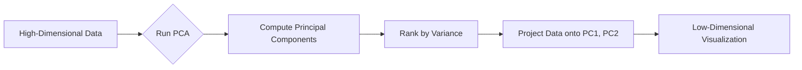

## **Introduction**

Our foundational journey through **Volume I** has successfully culminated in the mastery of data generation across diverse physical domains. Our ODE and PDE solvers (Chapters 7–12) produce vast amounts of information, creating highly stable trajectories for N-body systems and massive, evolving fields for heat or wave propagation.

This success introduces the modern computational challenge known as the **Data Deluge**. The raw output of a complex simulation is a high-dimensional structure—no longer a simple vector, but a **massive data matrix, $\mathbf{X}$**. For example, a molecular dynamics simulation of 1,000 particles run for 10,000 timesteps generates a matrix with 10,000 rows (observations) and 3,000 columns (spatial dimensions).

The challenge is that this high-dimensional data is difficult to inspect or visualize directly. We are faced with the task of **distilling the chaos** to find the underlying, dominant **patterns** and **axes of variance** that truly govern the system. This requires the final set of analytical tools: **Singular Value Decomposition (SVD)** and its primary application, **Principal Component Analysis (PCA)**.

## **Chapter Outline**

| Sec.     | Title                              | Core Ideas & Examples                                                                           |
| :------- | :--------------------------------- | :---------------------------------------------------------------------------------------------- |
| **16.1** | Singular Value Decomposition (SVD) | $\mathbf{X} = \mathbf{U}\mathbf{\Sigma}\mathbf{V}^T$, singular values $\sigma_i$, truncation.   |
| **16.2** | Application: Image Compression     | Using SVD truncation to filter noise and compress data.                                         |
| **16.3** | Principal Component Analysis (PCA) | Finding axes of maximum variance, dimensionality reduction.                                     |
| **16.4** | PCA as an Eigenvalue Problem       | Covariance matrix $\mathbf{C}$, $\mathbf{C}\mathbf{v} = \lambda\mathbf{v}$, SVD–PCA connection. |
| **16.5** | Application: MD Trajectories       | Extracting collective motion (e.g., protein folding) from thermal noise.                        |
| **16.6** | Summary & Bridge                   | Bridge to Chapter 17 (Monte Carlo methods).                                                     |

---

## **16.1 Singular Value Decomposition (SVD): The Master Factorization**

The **Singular Value Decomposition (SVD)** is the foundational factorization technique for analyzing any arbitrary matrix and is considered the master factorization in linear algebra [1, 4]. It is the most robust tool for compression and noise filtering.

---

### **The SVD Factorization**

SVD decomposes any $M \times N$ matrix $\mathbf{X}$ into the product of three other matrices:

$$
\mathbf{X} = \mathbf{U} \mathbf{\Sigma} \mathbf{V}^T
$$

* **$\mathbf{U}$ (Orthogonal Matrix):** Contains the **left singular vectors**, which define an orthonormal basis for the **rows** (observations/timesteps).
* **$\mathbf{\Sigma}$ (Diagonal Matrix):** Contains the **singular values ($\sigma_i$)** on its main diagonal, arranged in descending order ($\sigma_1 \ge \sigma_2 \ge \dots$).
* **$\mathbf{V}^T$ (Orthogonal Matrix):** Contains the **right singular vectors**, forming an orthonormal basis for the **columns** (variables/dimensions).

---

### **The Power of Truncation**

The singular values quantify the "importance" of each mode. This enables:

1. **Compression:** Most variance is concentrated in the first few singular values. Keeping only the largest $K \ll N$ singular values yields an accurate low-rank approximation.
2. **Noise Filtering:** Very small singular values often correspond to random noise. Setting these to zero and reconstructing $\mathbf{X}$ removes noise while keeping essential structure [1, 3].

---

## **16.2 Application: Image Compression**

A grayscale image is a 2D matrix $\mathbf{X}$ of pixel intensities.

!!! example "SVD Image Compression"
    A 500 × 500 cat image has 500 singular values.

    • Keeping the top K=50 values preserves almost all visual detail.
    • K=10 is blurrier but recognizable.
    • K=1 captures only the single dominant low-rank feature.

    SVD cleanly separates important low-rank structure from fine-grain noise.

---

## **16.3 Principal Component Analysis (PCA)**

**Principal Component Analysis (PCA)** applies the eigenvalue problem (Chapter 14) to a data matrix to find the axes capturing maximal variance [2, 5].

---

## **16.4 PCA as an Eigenvalue Problem**

Steps in PCA:

1. **Center the Data:** Subtract the mean of each column from the matrix $\mathbf{X}$.
2. **Compute Covariance Matrix:**
   $$
   \mathbf{C} = \mathbf{X}^T \mathbf{X}
   $$
3. **Solve the Eigensystem:**
   $$
   \mathbf{C}\mathbf{v} = \lambda \mathbf{v}
   $$

* **Eigenvalues ($\lambda_i$):** Variance captured by each Principal Component.
* **Eigenvectors ($\mathbf{v}_i$):** The Principal Components themselves.

??? question "PCA vs. SVD: What’s the difference?"
    PCA solves an eigenvalue problem for $\mathbf{C} = \mathbf{X}^T \mathbf{X}$.
    SVD factorizes $\mathbf{X}$ directly.

    Key fact: The right singular vectors (V) from SVD are exactly the eigenvectors of XᵀX.

---

### **The SVD–PCA Connection**

Since $\mathbf{C}$ may be huge and ill-conditioned, PCA is often computed via SVD:

$$
\mathbf{X} = \mathbf{U}\mathbf{\Sigma}\mathbf{V}^T
$$

The columns of $\mathbf{V}$ are the **Principal Components**.
This method is more numerically stable and is the recommended approach [1, 4].

---

## **16.5 Core Application: Analyzing Molecular Dynamics Trajectories**

In MD simulations, thousands of atoms move across millions of timesteps.

**Problem:** Raw trajectories contain both meaningful collective motions and high-frequency thermal noise.

**PCA Solution:**

1. Reduce the $3000$-dimensional positions to just a few Principal Components.
2. PC1 typically reveals a dominant motion (e.g., a protein "opening" mode).
3. PC2 and PC3 reveal secondary collective patterns.

Most physical behavior is captured in just a few PCs, with noise relegated to small eigenvalues.

---

## **16.6 Chapter Summary and Bridge to Chapter 17**

This chapter completed the analytical toolkit for data-driven interpretation:

* **SVD:** Master tool for compression and noise removal.
* **PCA:** Eigenvalue-based method for finding natural axes of variance.

Together they provide the structural analysis tools needed for modern simulation output.

The final chapter of Volume I introduces the third pillar of computational physics: **randomness**, leading to **Monte Carlo methods** in **Chapter 17**.

---

## **References**

[1] Press, W. H., Teukolsky, S. A., Vetterling, W. T., & Flannery, B. P. (2007). *Numerical Recipes* (3rd ed.).

[2] Jolliffe, I. T. (2002). *Principal Component Analysis* (2nd ed.).

[3] Quartieri, J. (2004). *The Singular Value Decomposition and its Applications in Molecular Dynamics*.

[4] Golub, G. H., & Van Loan, C. F. (2013). *Matrix Computations* (4th ed.).

[5] Newman, M. (2013). *Computational Physics*.
