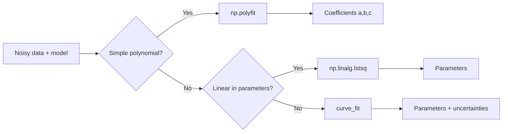

## **Introduction**

Up to this point, our numerical tools have operated on idealized mathematical functions—smooth, continuous expressions that can be evaluated at any real number with perfect clarity. Yet in real physics, such luxury is rare. Raw experimental measurements, simulation outputs, and observational datasets arrive not as formulas but as **discrete samples**: isolated points that approximate an underlying physical law.

This transition from analytical functions to data-driven functions represents a profound shift in methodology. We must learn to rebuild a functional description from the information available, and crucially, we must diagnose the *type* of data we are working with. Clean, high-fidelity values require a method that preserves exactness, while noisy laboratory data demands statistical interpretation rather than rigid reconstruction. Confusing these two worlds leads to either overfitting the noise or oversmoothing genuine physics.

This chapter develops two complementary toolkits—**Interpolation** and **Fitting**—each built for a distinct scientific scenario. Together they form the foundation for treating data as a usable, differentiable, and computable function, preparing us for the numerical calculus of later chapters.

---

## **Chapter Outline**

| **Sec.** | **Title** | **Core Ideas & Examples** |
| :--- | :--- | :--- |
| **4.1** | **The Discretized Function** | Difference between analytic formulas vs. discrete samples; identifying **exact/gappy** vs. **noisy/scattered** data; consequences of misclassification.                                    |
| **4.2** | **Interpolation (Connecting the Dots)** | Constructing an exact curve through clean data; failure of global high-degree polynomials (Runge’s Phenomenon); piecewise **Cubic Splines** and smoothness constraints ($f$, $f'$, $f''$). |
| **4.3** | **Fitting (Finding the Trend)** | When noise is present: residuals, least-squares minimization; $\chi^2$ definition; difference between linear-in-parameter models and nonlinear physical models.                            |
| **4.3.2** | **The Computational Toolbox** | Comparison of `np.polyfit` (linear) vs. `curve_fit` (nonlinear iterative search); importance of parameter nonlinearity; algebraic vs. optimizer-based solutions.                           |
| **4.4** | **Nonlinear Least Squares & Parameter Uncertainty** | Van der Waals example; extracting physical parameters from noisy data; covariance matrix from `curve_fit`; uncertainties from diagonal variances.                                          |
| **4.5** | **Summary & Bridge to Numerical Differentiation** | When to use interpolation vs. fitting; preparing data-derived functions for calculus; motivation for numerical differentiation in Chapter 5.                                               |

---

## **4.1 The Discretized Function**

In previous chapters, our algorithms enjoyed the luxury of **perfect functions**—analytical formulas, such as $f(x) = \sin(x)$, that are continuous, infinitely precise, and callable at any arbitrary point $x$. However, in real-world physics, a "function" rarely arrives as a formula; it arrives as **discrete data**. This data, whether from a laboratory instrument or a simulated output, presents a new computational challenge that requires a fundamental change in methodology.

The essential first step in analyzing discrete data is to correctly identify its underlying **flavor**:

1.  **The "Gappy" Function (Interpolation):** This data is **clean and exact**, usually sourced from a precise simulation, a textbook table, or a high-fidelity sensor. Every point is trusted, but the data is sparse. The computational goal is to **"fill in the gaps"** or **"connect the dots"** in the most physically smooth manner possible.
2.  **The "Noisy" Function (Fitting):** This data is **messy and inexact**, contaminated by experimental error, thermal noise, or statistical fluctuations. We do not trust every individual point. The goal is to **"find the trend"**—the simple, underlying physical model that passes *through the middle* of the data cloud.

!!! tip "The Data-Driven Function"
    Think of this chapter as learning to build a "function object" from a list of numbers. The method you choose (Spline vs. Fit) determines the *type* of object you build and what it's useful for.

The **central mandate** of this chapter is to distinguish between these two scenarios. Applying an interpolation model to noisy data is a catastrophic scientific error, as it models the random **experimental noise** as if it were a genuine physical feature, resulting in an absurdly over-complex model. Conversely, using a simplified fitting model on clean data unnecessarily "smooths out" real, valuable information. We must, therefore, develop two distinct and non-interchangeable toolkits.

---

## **4.2 Interpolation (Connecting the Dots)**

The challenge of interpolation is to construct a continuous curve $f(x)$ that passes **exactly** through a given set of clean data points $(x_i, y_i)$.

-----

### **The Failure of Global Polynomials: Runge's Phenomenon**

The initial, intuitive approach is to use a single **polynomial interpolation**. Mathematics guarantees that for $N$ data points, a **unique polynomial of degree $N-1$** exists that passes perfectly through all of them. While mathematically correct, this method is fundamentally flawed for practical applications.

This flaw is demonstrated by **Runge's Phenomenon**. As the degree of the interpolating polynomial increases (i.e., as $N$ increases), the polynomial becomes "stiff" and "brittle". To satisfy the constraint of passing through all points, the curve is forced to **wiggle violently** in the interior and often **explodes** into large, unphysical oscillations near the boundaries of the domain. This shows that **single high-degree polynomials are numerically unstable for interpolation** and must be avoided. The function's global nature means a change in one data point affects the shape of the entire curve.

??? question "Why not just use a low-degree polynomial?"
    You could, but a single low-degree polynomial (like a quadratic) is not flexible enough to pass *exactly* through many data points. It would be a *fit*, not an *interpolation*. The problem arises when $N$ is large (e.g., $N > 10$).

-----

### **The Physicist's Solution: Cubic Splines**

The alternative to the single, stiff polynomial is a **Cubic Spline**. This approach is named after the flexible drafting tool (a "spline") used to pin points ("knots") and allow the material to settle into the smoothest possible curve.

A Cubic Spline is a **piecewise** function that uses a separate, low-degree **cubic polynomial** ($y=ax^3+bx^2+cx+d$) for each interval *between* data points. This piecewise structure avoids the global instability of Runge's Phenomenon. To ensure the resulting curve is smooth, four critical constraints are mathematically enforced at each interior data point (knot):
1.  The two joining polynomials must meet at the data point (continuity, $f$).
2.  The two joining polynomials must have the **same slope** (first derivative continuity, $f'$).
3.  The two joining polynomials must have the **same curvature** (second derivative continuity, $f''$).

These constraints provide a large, sparse **tridiagonal system of linear equations** (a precursor to concepts in Chapter 13) that, once solved, yields all the coefficients for every piecewise cubic. The resulting `CubicSpline` object (e.g., in `SciPy`) is the professional standard for interpolation, providing a smooth, well-behaved curve.

A significant advantage of the spline is that, once constructed, it is an analytical function for each piece. This allows the object to return not just the interpolated value $f(x)$, but also the **first and second derivatives** ($f'(x)$ and $f''(x)$) at any arbitrary point in the domain. This capability is critical for the calculus-based numerical methods developed in later chapters.

```
# Illustrative pseudo-code for *using* a Cubic Spline

# 1. Provide the clean, exact data

x_data = [0.0, 1.0, 2.0, 3.0]
y_data = [1.2, 3.1, 2.9, 4.0]

# 2. Create the spline "function object"

# This solves the tridiagonal system internally

spline_f = create_cubic_spline(x_data, y_data)

# 3\. Use the object as a new, continuous function

x_new = 1.5
y_new = spline_f(x_new)           # Get interpolated value
y_deriv = spline_f.derivative(x_new) # Get f'(1.5)

```

---

## **4.3 Fitting (Finding the Trend)**

When data is contaminated by noise, the goal shifts entirely from "connecting the dots" to finding the best mathematical representation of the **underlying physical law** that generated the data. This is the domain of fitting, where the physicist must first provide a **theoretical model** (e.g., $N(t) = N_0 e^{-\lambda t}$) and then use the data to find the optimal values for the model's parameters ($N_0, \lambda$, etc.).

-----

### **The Workhorse: The Method of Least Squares**
To mathematically define the "best fit," we must quantify the error of any proposed model. For any data point $(x_i, y_i)$, the **residual** ($r_i$) is the vertical distance between the experimental data point $y_i$ and the model's predicted value $y_{\text{model}, i}$:

$$
r_i = y_{\text{data}, i} - y_{\text{model}, i}
$$

The industry standard for quantifying and minimizing the total error is the **Method of Least Squares**. This method defines the "best fit" as the one that minimizes the **Sum of the Squares of the residuals** ($\chi^2$):

$$
\chi^2 = \sum_{i=1}^N r_i^2 = \sum_{i=1}^N (y_i - y_{\text{model}, i})^2
$$

The process of squaring the residuals is crucial because it prevents positive and negative errors from canceling each other out, which would otherwise give a deceptively small total error. Furthermore, the squaring operation heavily **punishes large errors**, forcing the fitted model to stay close to all data points. Minimizing $\chi^2$ is an **optimization problem** (a preview of Volume III).

!!! example "Visualizing $\chi^2$"
    Imagine your data points are fixed magnets. Your model $f(x, a, b)$ is a flexible metal wire, and the parameters $a$ and $b$ are knobs that change its shape. The residuals $r_i$ are springs connecting the magnets to the wire. Minimizing $\chi^2$ is like letting the system settle into the lowest-energy state, where the total "pull" from the stretched springs is minimized.

A critical observation is made when $\chi^2$ is minimized by setting its partial derivatives with respect to the model's parameters to zero ($\partial \chi^2 / \partial \text{param}_i = 0$). For **linear models** (where the parameters appear linearly, such as in a polynomial fit $y=ax^2+bx+c$), this optimization problem simplifies directly into a **system of linear equations** for the unknown parameters.

-----

### **The Computational Toolbox**

The choice of fitting tool depends entirely on the model's mathematical structure:

| Tool | Purpose | Mechanism | Parameter Linearity |
| :--- | :--- | :--- | :--- |
| **`np.polyfit`** | Specialized for **polynomials** ($y=ax^2+bx+c$). | Solves the simple **system of linear equations** derived from $\chi^2$ minimization. | **Linear in parameters** ($a, b, c$). |
| **`scipy.optimize.curve_fit`** | **General-purpose** tool for any custom physical model. | Uses an **iterative optimizer** (like the root-finders in Chapter 3) to "hunt" for the $\chi^2$ minimum. | **Required** for models **non-linear in parameters** (e.g., $e^{-\lambda t}$ or $1/(V-b)$). |

The distinction between **linearity** and **non-linearity in parameters** is paramount. Non-linear models, where parameters are embedded in complex ways (e.g., in an exponent or a denominator), require the iterative search algorithm implemented by `curve_fit`, as the linear algebra simplification fails.





-----

## **4.4 Nonlinear Least Squares & Parameter Uncertainty**

The **Van der Waals equation**

$$
P(V) = \frac{nRT}{V - nb} - a \frac{n^2}{V^2}
$$

serves as a perfect example of non-linear fitting. Given noisy pressure-volume data, finding the physical parameters $a$ and $b$ requires `scipy.optimize.curve_fit` because the $b$ term is in a denominator, making the model non-linear in $b$.

```python
# Illustrative pseudo-code for *using* curve_fit
# (Here, we assume 'n' is a known constant, e.g., 1 mole)

# 1. Define the model function (non-linear in 'a', 'b')
#    The first argument must be the independent variable (V)
#    Subsequent arguments are the parameters to be fit (a, b, nRT)
function vdw_model(V, a, b, nRT):
n = 1.0 # Assume n=1 mole for this example
return (nRT / (V - n*b)) - (a * (n**2 / V**2))

# 2. Provide noisy data
V_data = [...]
P_data = [...]

# 3. Fit the model to the data
# popt = optimal parameters [a, b, nRT]
# pcov = covariance matrix
popt, pcov = curve_fit(vdw_model, V_data, P_data)

# 4. Extract parameters and uncertainties
a_fit, b_fit, nRT_fit = popt

a_unc = sqrt(pcov[0, 0])
b_unc = sqrt(pcov[1, 1])
nRT_unc = sqrt(pcov[2, 2])
```

The successful application of `curve_fit` yields two essential outputs:

1.  **`popt` (Optimal Parameters):** The vector containing the best-fit values for the parameters $a$, $b$, and $nRT$ that minimize $\chi^2$.
2.  **`pcov` (Covariance Matrix):** A powerful bonus, the diagonal elements of this matrix provide the **variance** (the square of the uncertainty) on each fitted parameter. The uncertainty of a parameter $P_i$ is $\pm \sqrt{\text{pcov}[i, i]}$.

The ability to extract these quantified error bars is a central requirement of the scientific method, transforming a simple numerical answer into a valid physical measurement.

-----

## **4.5 Summary & Bridge to Numerical Differentiation**

We have successfully established a complete toolkit for handling discrete data. The ultimate lesson is to adhere to the data "mantra":

* For **clean, exact data** $\to$ Use **Interpolation** (`CubicSpline`) to connect the dots.
* For **noisy, experimental data** $\to$ Use **Fitting** (`curve_fit`) to find the trend.

We now possess two fundamentally different, yet equally valid, methods for defining a "function" for computational use: an analytical formula (Chapter 1) or a data-driven object (a spline or a fitted model).

This prepares us for the next challenge: performing the core operations of physics on these discrete functions. Since physics is defined by the study of change, we must compute **derivatives** (e.g., $F = -dV/dx$). This requires translating continuous calculus rules into finite algebraic rules for a discrete grid, which is the subject of **Numerical Differentiation** in Chapter 5.

-----

## **References**

[1] Higham, N.J. (2002). *Accuracy and Stability of Numerical Algorithms*. SIAM.

[2] Quarteroni, A., Sacco, R., & Saleri, F. (2007). *Numerical Mathematics*. Springer.

[3] Press, W. H., Teukolsky, S. A., Vetterling, W. T., & Flannery, B. P. (2007). *Numerical Recipes: The Art of Scientific Computing* (3rd ed.). Cambridge University Press.

