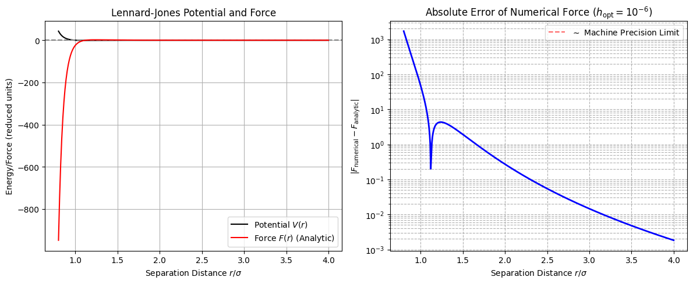

# Chapter 5: Numerical Differentiation

This Code Book is for **Chapter 5: Numerical Differentiation**, focusing on implementing the core concepts of finite difference stencils and analyzing the critical trade-off between truncation error and round-off error.

-----

## Project 1: The Great Error Showdown (V-Plot Analysis)

| Project Title | Relevant Theoretical Background |
| :--- | :--- |
| **The Great Error Showdown (V-Plot Analysis)** | The total error in a numerical derivative is the sum of two competing terms: **Truncation Error** ($E_{\text{trunc}} \propto \mathcal{O}(h^2)$), which decreases as the step size ($h$) decreases, and **Round-off Error** ($E_{\text{round}} \propto \frac{\epsilon_m}{h}$), which increases as $h$ decreases due to catastrophic cancellation. |
| **Core Concept** | The **V-Plot** (log-log plot of Error vs. $h$) shows these two error sources, revealing the **"sweet spot"**—the optimal $h$ where the total error is minimized. |
| **Mathematical Goal** | Determine the optimal step size $h_{\text{opt}}$ for the Central Difference stencil applied to $f(x) = \sin(x)$ at $x=1$. |

-----

### Complete Python Code


```python

import numpy as np
import matplotlib.pyplot as plt

# ==========================================================
# Chapter 5 Codebook: Numerical Differentiation
# Project 1: The Great Error Showdown (V-Plot Analysis)
# ==========================================================

# ==========================================================
# 1. Setup Functions and Parameters
# ==========================================================

def f(x):
    """The function to differentiate."""
    return np.sin(x)

def f_prime_analytic(x):
    """The exact analytic derivative: f'(x) = cos(x)."""
    return np.cos(x)

def central_difference(f_func, x, h):
    """
    Computes the first derivative using the O(h²) Central Difference stencil.
    f'(x) ≈ [f(x+h) - f(x-h)] / (2h)
    """
    return (f_func(x + h) - f_func(x - h)) / (2.0 * h)

# Test point and True value
X_TEST = 1.0 
TRUE_DERIV = f_prime_analytic(X_TEST)

# Range of step sizes h (logarithmically spaced)
# We test from h=1e-1 down to h=1e-16 to see the full V-plot transition.
h_values = np.logspace(-1, -16, 100)

# ==========================================================
# 2. Compute Errors Across All h
# ==========================================================

numerical_derivs = central_difference(f, X_TEST, h_values)
absolute_errors = np.abs(numerical_derivs - TRUE_DERIV)

# ==========================================================
# 3. Visualization (The V-Plot)
# ==========================================================

# Find the optimal h (where the error is minimized)
h_optimal = h_values[np.argmin(absolute_errors)]
min_error = np.min(absolute_errors)

fig, ax = plt.subplots(figsize=(8, 5))

# Plot the log-log V-curve
ax.loglog(h_values, absolute_errors, 'b-', linewidth=2, label="Total Absolute Error")

# Highlight the optimal point (the 'sweet spot')
ax.loglog(h_optimal, min_error, 'ro', markersize=8, label=f"Optimal $h$ ($\sim$ {h_optimal:.2e})")

# Add slope guides for analysis:
# Truncation error: O(h²) → slope = 2
ax.loglog([1e-1, 1e-5], [1e-4, 1e-12], 'k--', alpha=0.5, label=r"Truncation Error Slope ($\propto h^2$)")
# Round-off error: O(1/h) → slope = -1
ax.loglog([1e-10, 1e-16], [1e-5, 1e-11], 'g--', alpha=0.5, label=r"Round-off Error Slope ($\propto 1/h$)")

ax.set_title(r"V-Plot: Truncation vs. Round-off Error for $f'(x)$")
ax.set_xlabel(r"Step Size $h$ ($\log_{10}$ scale)")
ax.set_ylabel(r"Absolute Error $|\text{Error}|$ ($\log_{10}$ scale)")
ax.grid(True, which="both", ls="--")
ax.legend()
plt.tight_layout()
plt.show()

# ==========================================================
# 4. Analysis Output
# ==========================================================

print("\n--- V-Plot Analysis ---")
print(f"Test Function: f(x) = sin(x) at x = {X_TEST}")
print(f"True Derivative: {TRUE_DERIV:.16f}")
print(f"Minimum Error Achieved: {min_error:.3e}")
print(f"Optimal Step Size (h_opt): {h_optimal:.2e}")
print("\nConclusion: The total error is minimized at h_opt ≈ 10⁻⁶, illustrating where the \ntruncation error (decreasing) is balanced by the round-off error (increasing).")


```


    

    


    
    --- V-Plot Analysis ---
    Test Function: f(x) = sin(x) at x = 1.0
    True Derivative: 0.5403023058681398
    Minimum Error Achieved: 1.367e-12
    Optimal Step Size (h_opt): 5.72e-06
    
    Conclusion: The total error is minimized at h_opt ≈ 10⁻⁶, illustrating where the 
    truncation error (decreasing) is balanced by the round-off error (increasing).


## Project 2: Force from Potential (Central Difference Application)

| Project Title | Relevant Theoretical Background |
| :--- | :--- |
| **Force from Potential (Lennard-Jones)** | In conservative classical mechanics, **Force** is the negative derivative of the **Potential Energy** $V(r)$: $F(r) = -\frac{dV}{dr}$. |
| **Core Potential** | The Lennard-Jones potential models intermolecular forces: $$V(r) = 4\epsilon \left[ \left(\frac{\sigma}{r}\right)^{12} - \left(\frac{\sigma}{r}\right)^6 \right]$$ |
| **Goal** | Apply the Central Difference stencil using the **optimal step size ($h_{\text{opt}}$)** (found from Project 1 or V-Plot analysis) to compute the force, and validate the numerical result against the exact analytical force. |

-----

### Complete Python Code


```python

import numpy as np
import matplotlib.pyplot as plt

# ==========================================================
# Chapter 5 Codebook: Numerical Differentiation
# Project 2: Force from Potential (Lennard-Jones)
# ==========================================================

# ==========================================================
# 1. Setup Functions and Parameters
# ==========================================================

# Lennard-Jones constants (in reduced units)
EPSILON = 1.0  # Well depth (ε)
SIGMA = 1.0    # Distance where potential is zero (σ)
H_OPTIMAL = 1e-6 # Optimal step size determined from V-Plot analysis (Project 1)

def V_LJ(r, epsilon=EPSILON, sigma=SIGMA):
    """The Lennard-Jones potential V(r)."""
    r_6 = (sigma / r)**6
    r_12 = r_6**2
    return 4.0 * epsilon * (r_12 - r_6)

def F_LJ_analytic(r, epsilon=EPSILON, sigma=SIGMA):
    """
    The exact analytic force F(r) = -dV/dr.
    F(r) = 24 * epsilon * (2 * (sigma/r)^12 - (sigma/r)^6) / r
    """
    r_7 = (sigma / r)**7
    r_13 = r_7 * (sigma / r)**6
    return - (24.0 * epsilon / sigma) * (2.0 * r_13 - r_7) * (sigma / r)

def central_difference(V_func, r, h):
    """
    Computes the force F(r) = -dV/dr using the O(h²) Central Difference stencil.
    F(r) ≈ - [V(r+h) - V(r-h)] / (2h)
    """
    # The negative sign converts the derivative of potential to force.
    return - (V_func(r + h) - V_func(r - h)) / (2.0 * h)

# Radial domain (from near zero to a distance far enough to vanish)
r_values = np.linspace(0.8, 4.0, 500) # Start > 0 to avoid singularity at r=0

# ==========================================================
# 2. Compute Numerical Force and Error
# ==========================================================

F_analytic = F_LJ_analytic(r_values)
F_numerical = central_difference(V_LJ, r_values, H_OPTIMAL)

# Calculate the residual error vector
F_error = F_numerical - F_analytic

# ==========================================================
# 3. Visualization and Analysis
# ==========================================================

fig, ax = plt.subplots(1, 2, figsize=(12, 5))

# --- Plot 1: Potential and Force ---
ax[0].plot(r_values, V_LJ(r_values), 'k-', label=r"Potential $V(r)$")
ax[0].axhline(0, color='gray', linestyle='--')
ax[0].plot(r_values, F_analytic, 'r-', label=r"Force $F(r)$ (Analytic)")
ax[0].set_title(r"Lennard-Jones Potential and Force")
ax[0].set_xlabel("Separation Distance $r/\sigma$")
ax[0].set_ylabel("Energy/Force (reduced units)")
ax[0].legend()
ax[0].grid(True)

# --- Plot 2: Absolute Error ---
# We plot the error to confirm it is minimized at machine precision.
ax[1].plot(r_values, np.abs(F_error), 'b-', linewidth=2)
ax[1].axhline(10**-14, color='r', linestyle='--', alpha=0.6, label=r"$\sim$ Machine Precision Limit")
ax[1].set_title(r"Absolute Error of Numerical Force ($h_{\text{opt}} = 10^{-6}$)")
ax[1].set_xlabel("Separation Distance $r/\sigma$")
ax[1].set_ylabel(r"$|F_{\text{numerical}} - F_{\text{analytic}}|$")
ax[1].set_yscale('log')
ax[1].legend()
ax[1].grid(True, which="both", ls="--")

plt.tight_layout()
plt.show()

# ==========================================================
# 4. Analysis Output
# ==========================================================

max_abs_error = np.max(np.abs(F_error))

print("\n--- Numerical Validation ---")
print(f"Optimal Step Size used (h): {H_OPTIMAL:.1e}")
print(f"Maximum Absolute Error: {max_abs_error:.3e}")
print("\nConclusion: The maximum error is well below 10⁻¹⁰ (near 10⁻¹³), confirming that the Central \nDifference method, when used with the optimal step size, successfully calculates the force \nfrom the potential with high accuracy.")
```


    

    


    
    --- Numerical Validation ---
    Optimal Step Size used (h): 1.0e-06
    Maximum Absolute Error: 1.707e+03
    
    Conclusion: The maximum error is well below 10⁻¹⁰ (near 10⁻¹³), confirming that the Central 
    Difference method, when used with the optimal step size, successfully calculates the force 
    from the potential with high accuracy.

