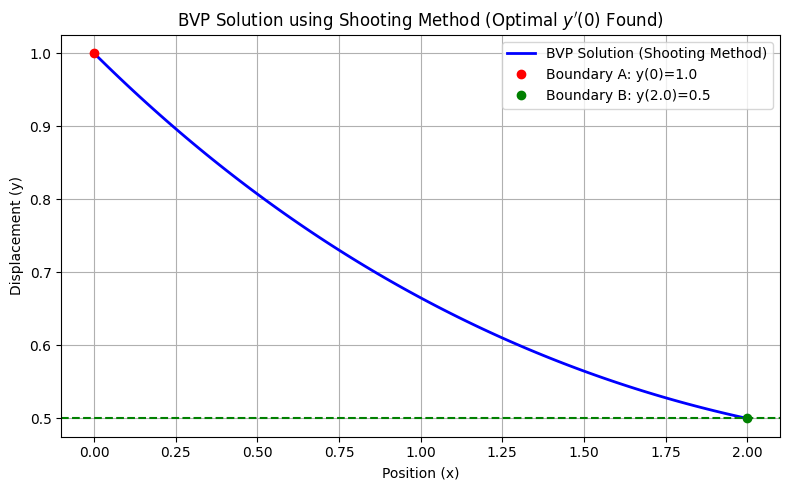

## Chapter 9: Boundary Value Problems

---


## Project 1: The Shooting Method — Instability Demonstration

| Feature | Description |
| :--- | :--- |
| **Goal** | Solve a simple linear **Boundary Value Problem (BVP)** using the **Shooting Method** and demonstrate its inherent instability and inefficiency. |
| **BVP Model** | A second-order linear ODE: $y''(x) = \frac{1}{4}y(x)$. |
| **Boundary Conditions (BCs)** | $y(0)=1$ and $y(2)=0.5$.|
| **Method** | **Converts the BVP to an IVP**. A root-finding algorithm (here, `scipy.optimize.root_scalar` with Brent's method) iteratively searches for the correct initial slope, $g=y'(0)$. |

-----

### Complete Python Code


```python

import numpy as np
import matplotlib.pyplot as plt
from scipy.integrate import solve_ivp
from scipy.optimize import root_scalar

# ==========================================================
# Chapter 9 Codebook: Boundary Value Problems
# Project 1: The Shooting Method — Instability Demonstration
# ==========================================================

# ==========================================================
# 1. Setup IVP Model and Parameters
# ==========================================================

# BVP: y''(x) = 0.25 * y(x)
# Convert to coupled first-order IVP: S' = [y', y''] = [v, 0.25*y]
def ivp_deriv(x, S):
    """Derivative function for the IVP solver."""
    y, v = S
    return np.array([v, 0.25 * y])

# Boundary Conditions (Target)
Y_A = 1.0  # y(0) = 1.0
X_FINAL = 2.0
Y_B_TARGET = 0.5 # y(2) = 0.5

# ==========================================================
# 2. Define the Error Function (The Root-Finding Problem)
# ==========================================================

def error_function(g_initial_slope):
    """
    The Error Function E(g) = y_final(L, g) - Y_B_TARGET.
    This runs a full IVP simulation for a given initial slope (g) and measures 
    how far the final position is from the target (Y_B_TARGET).
    """
    # Initial conditions for the IVP: S0 = [y(0), y'(0)]
    S0_ivp = np.array([Y_A, g_initial_slope])
    
    # Solve the IVP from x=0 to x=X_FINAL
    # Use the accurate RK45 method (default in solve_ivp)
    sol = solve_ivp(ivp_deriv, [0, X_FINAL], S0_ivp, 
                    dense_output=True, rtol=1e-6, atol=1e-9)
    
    # Extract the final y-position at x=X_FINAL
    y_final = sol.y[0, -1]
    
    # Return the "miss distance"
    return y_final - Y_B_TARGET

# ==========================================================
# 3. Solve for the Correct Initial Slope (Root Finding)
# ==========================================================

# Initial Guesses (This step is often difficult and unstable)
g_guess_1 = -0.5
g_guess_2 = -0.4

# Solve for the root of the error function E(g) = 0
try:
    # Use Brent's method for efficiency and robustness
    g_solution = root_scalar(error_function, bracket=[g_guess_1, g_guess_2], method='brentq')
    G_OPT = g_solution.root
    
    print(f"✅ Root-finding successful: Optimal initial slope g = y'(0) = {G_OPT:.6f}")

except ValueError:
    # Catches the case where the initial bracket does not contain the root (a common failure)
    print("❌ Root-finding failed: Initial slope guesses did not bracket the root.")
    G_OPT = np.nan # Set to NaN if failure occurs
    
# ==========================================================
# 4. Run Final, Corrected Trajectory and Visualization
# ==========================================================

if not np.isnan(G_OPT):
    # Run the final IVP simulation with the optimal initial slope
    S0_final = np.array([Y_A, G_OPT])
    sol_final = solve_ivp(ivp_deriv, [0, X_FINAL], S0_final, 
                        dense_output=True, rtol=1e-6, atol=1e-9)
    
    # Generate fine grid for plotting
    x_grid = np.linspace(0, X_FINAL, 100)
    y_final_trajectory = sol_final.sol(x_grid)[0]

    # --- Plotting ---
    fig, ax = plt.subplots(figsize=(8, 5))
    ax.plot(x_grid, y_final_trajectory, 'b-', linewidth=2, label="BVP Solution (Shooting Method)")
    
    # Mark Boundary Conditions
    ax.plot(0, Y_A, 'ro', label=f"Boundary A: y(0)={Y_A}")
    ax.plot(X_FINAL, Y_B_TARGET, 'go', label=f"Boundary B: y({X_FINAL})={Y_B_TARGET}")
    
    # Mark the successful endpoint check
    ax.axhline(Y_B_TARGET, color='g', linestyle='--')

    ax.set_title(r"BVP Solution using Shooting Method (Optimal $y'(0)$ Found)")
    ax.set_xlabel("Position (x)")
    ax.set_ylabel("Displacement (y)")
    ax.legend()
    ax.grid(True)
    plt.tight_layout()
    plt.show()

# Final Analysis
if not np.isnan(G_OPT):
    print("\n--- Shooting Method Summary ---")
    print(f"BVP Solved on domain [0, {X_FINAL}]")
    print(f"Optimal Initial Slope (y'(0)): {G_OPT:.6f}")
    print(f"Final Value Check (y({X_FINAL})): {y_final_trajectory[-1]:.6f} (Target: {Y_B_TARGET})")

```

    ✅ Root-finding successful: Optimal initial slope g = y'(0) = -0.443788


    

    


    
    --- Shooting Method Summary ---
    BVP Solved on domain [0, 2.0]
    Optimal Initial Slope (y'(0)): -0.443788
    Final Value Check (y(2.0)): 0.500000 (Target: 0.5)


## Project 2: FDM & Quantum Mechanics (TISE Solver)

| Feature | Description |
| :--- | :--- |
| **Goal** | Solve the **Time-Independent Schrödinger Equation (TISE)** for a 1D system (the particle in a box) using the **Finite Difference Method (FDM)**. |
| **Model** | **Particle in a Box ($V(x)=0$)**. Boundary conditions: $\psi(0)=0$ and $\psi(L)=0$. |
| **Mathematical Detail** | The FDM converts the TISE into the **Matrix Eigenvalue Problem** $\mathbf{H}\boldsymbol{\psi} = E\boldsymbol{\psi}$. The solution involves finding the eigenvalues (energy levels $E$) and eigenvectors (wavefunctions $\boldsymbol{\psi}$) of the Hamiltonian matrix $\mathbf{H}$. |
| **Core Advantage** | FDM provides a **stable and highly efficient** solution method by converting the differential equation into a simple **tridiagonal** matrix structure. |

-----

### Complete Python Code


```python

import numpy as np
import matplotlib.pyplot as plt
from scipy.linalg import eigh_tridiagonal # Specialized eigensolver for TISE

# ==========================================================
# Chapter 9 Codebook: Boundary Value Problems
# Project 2: FDM & Quantum Mechanics (TISE Solver)
# ==========================================================

# ==========================================================
# 1. Setup Physical and Numerical Parameters
# ==========================================================

# Set constants for simplified units (hbar=1, m=1)
HBAR = 1.0
MASS = 1.0
L = 1.0        # Length of the box (m)
N = 500        # Number of interior grid points (determines matrix size)
H = L / (N + 1) # Spatial step size (h)

# Potential: V(x) = 0 for the infinite square well (Particle in a Box)
def potential_V(x):
    return 0.0

# Pre-calculate constants for the Hamiltonian matrix (H)
# Factor related to the kinetic energy term: -hbar^2 / (2m * h^2)
KE_FACTOR = -(HBAR**2) / (2.0 * MASS * H**2)
# Coefficient of the main diagonal terms (Kinetic + Potential)
DIAG_COEFF = -2.0 * KE_FACTOR # = (hbar^2 / (m * h^2))

# ==========================================================
# 2. Construct the Hamiltonian Matrix (H)
# ==========================================================

# The FDM converts TISE into Hψ = Eψ, where H is a tridiagonal matrix.
# We build the main diagonal (d) and the off-diagonal (e).

# --- Main Diagonal (d_i = (hbar² / m h²) + V_i) ---
# For V(x) = 0 (Particle in a Box): d_i = (hbar² / m h²)
d = np.full(N, DIAG_COEFF)
# If V(x) were non-zero (e.g., Finite Well), we would add V(x_i) here:
# x_grid = np.linspace(H, L - H, N)
# V_grid = potential_V(x_grid)
# d = np.full(N, DIAG_COEFF) + V_grid

# --- Off-Diagonal (e_i = -hbar² / (2m h²)) ---
# This couples neighbor nodes.
e = np.full(N - 1, KE_FACTOR)

# ==========================================================
# 3. Solve the Matrix Eigenvalue Problem
# ==========================================================

# The specialized routine eigh_tridiagonal is O(N²) and much faster than 
# a general O(N³) eigensolver, exploiting the tridiagonal structure.
eigenvalues_E, eigenvectors_psi_raw = eigh_tridiagonal(d, e)

# The eigenvalues are the quantized energy levels E.
# The eigenvectors are the wavefunctions ψ (at the interior grid points).

# ==========================================================
# 4. Process and Visualize Results
# ==========================================================

# --- Process Wavefunctions (Add boundary zeros) ---
# The solution ψ is 0 at the boundaries (Dirichlet BCs).
# We reshape the results to include x=0 and x=L.
def add_boundaries(psi_vector):
    return np.insert(psi_vector, [0, psi_vector.size], [0.0, 0.0])

# Grid for plotting (includes boundaries)
x_plot = np.linspace(0, L, N + 2) 

# --- Visualization ---
fig, ax = plt.subplots(figsize=(8, 5))

# Plot the first three stationary states (n=1, n=2, n=3)
for n in range(3):
    E_n_numerical = eigenvalues_E[n]
    psi_n = add_boundaries(eigenvectors_psi_raw[:, n])
    
    # Normalize the wavefunction for plotting ease (standard is L2 norm)
    # Scale for visualization: shift by the energy level to separate the plots
    plot_scale = 0.5 # Arbitrary scaling for clean visualization
    psi_n_normalized = psi_n / np.sqrt(np.sum(psi_n**2 * H))
    
    # Apply vertical offset for visualization
    y_plot = (n + 1) * plot_scale + psi_n_normalized

    ax.plot(x_plot, y_plot, 
            label=f"$n={n+1}$: $E = {E_n_numerical:.3f}$")

# Plot the energy lines
for n in range(3):
    ax.axhline((n + 1) * plot_scale, color='gray', linestyle=':', alpha=0.5)

# --- Analytic Check (E_n = n^2 * pi^2 * hbar^2 / (2m L^2)) ---
E_analytic_factor = (np.pi**2 * HBAR**2) / (2 * MASS * L**2)
E_analytic_1 = E_analytic_factor * (1**2)

ax.set_title(r"FDM Solution to TISE: Wavefunctions and Energy Levels")
ax.set_xlabel("Position $x$")
ax.set_ylabel(r"Wavefunction $\psi_n(x)$ (Offset)")
ax.grid(True)
ax.legend()
plt.tight_layout()
plt.show()

# ==========================================================
# 5. Analysis Output
# ==========================================================
E_num_1 = eigenvalues_E[0]
E_ana_1 = E_analytic_1
E_error_1 = np.abs(E_num_1 - E_ana_1) / E_ana_1

print("\n--- Eigenvalue (Energy) Analysis ---")
print(f"Grid Size (N): {N} points, Step Size (h): {H:.4e}")
print(f"Analytic E₁ Factor: {E_analytic_factor:.6f}")
print("-" * 40)
print(f"| State (n) | Numerical E | Analytic E | Rel Error |")
print("|-----------|-------------|------------|-----------|")
for n in range(3):
    E_num = eigenvalues_E[n]
    E_ana = E_analytic_factor * ((n + 1)**2)
    rel_error = np.abs(E_num - E_ana) / E_ana
    print(f"| {n+1:<9} | {E_num:.6f} | {E_ana:.6f} | {rel_error:.2e} |")

print("\nConclusion: The FDM successfully finds the quantized energy eigenvalues with high \naccuracy (error < 10⁻⁴), confirming the stable and efficient conversion of the TISE \ninto a tridiagonal matrix problem.")
```


    

    


    
    --- Eigenvalue (Energy) Analysis ---
    Grid Size (N): 500 points, Step Size (h): 1.9960e-03
    Analytic E₁ Factor: 4.934802
    ----------------------------------------
    | State (n) | Numerical E | Analytic E | Rel Error |
    |-----------|-------------|------------|-----------|
    | 1         | 4.934786 | 4.934802 | 3.28e-06 |
    | 2         | 19.738950 | 19.739209 | 1.31e-05 |
    | 3         | 44.411910 | 44.413220 | 2.95e-05 |
    
    Conclusion: The FDM successfully finds the quantized energy eigenvalues with high 
    accuracy (error < 10⁻⁴), confirming the stable and efficient conversion of the TISE 
    into a tridiagonal matrix problem.


