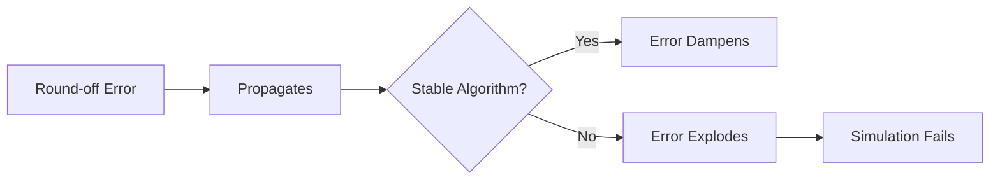

# STYLE GUIDES FOR DEVELOPERS

-------

## Introduction 

---

This chapter transitions from the abstract world of theoretical physics to the practical constraints of the "Digital Lab." Before we can simulate any physical system, we must first confront the tool itself: the computer. The central theme of this chapter is that a computer is not a perfect calculator. It does not work with the infinite, continuous Real Numbers ($\mathbb{R}$) of theoretical mathematics, but with finite, discrete approximations.

This fundamental discrepancy is the source of all computational error. This chapter will deconstruct this "foundational crisis," introducing the standard compromise used to represent numbers (floating-point) and then building a rigorous framework for understanding, classifying, and mitigating the different types of errors that arise. Mastering these concepts is the first and most critical step toward building numerical models that are not just mathematically correct, but computationally stable and reliable.

---

### Questions
---

??? question "Why can’t we store real numbers exactly?"
    Because most real numbers require infinitely many bits, while computers have finite registers.

---

### Insights

---

!!! tip "Key Insight"
    The *first* step in computational physics is accepting that numbers are **never exact** — not even the ones that look simple.

---

### Examples

---

!!! example "Derivative Approximation"
    Using $\frac{f(x+h)-f(x)}{h}$ to approximate $f'(x)$ ignores all higher-order Taylor terms.

---

### Quiz

---

!!! note "Quiz"
    **Why can't we store real numbers exactly?**

    - A. Magic numbers disappear  
    - B. Reals need infinite bits  
    - C. Processors are inaccurate  
    - D. Rounding is mandatory

    ??? info "See Answer"
        **Correct: B**

---

### Interview-Style Question

---

!!! abstract "Interview-Style Question"

    **Q:** In the context of computational physics, why is it philosophically critical to differentiate between the mathematical definition of a number (e.g., $1/3$) and its digital representation (e.g., `0.3333333333333333`)?

    ??? info "Answer Strategy"
        This distinction is the foundation of **numerical stability**.

        1. **Identity vs. Approximation:**  
           In mathematics, $1/3 + 1/3 + 1/3 = 1$ is an identity. In computation, the stored value is merely an approximation.

        2. **Error In, Error Out:**  
           The digital version of $1/3$ starts with rounding error the moment it is stored.

        3. **Error Propagation:**  
           Adding three approximations compounds the initial error, producing a result slightly below $1$.

        4. **The Takeaway:**  
           Every computation must be seen as a step where error can grow or shrink. This mindset is the core of **error propagation** and **algorithmic stability**.

      
---

### Diagram

----

## Chapter Outline 

| **Sec.** | **Title**                                 | **Core Ideas & Examples**                                                                                                                      |
| -------- | ----------------------------------------- | ---------------------------------------------------------------------------------------------------------------------------------------------- |
| **2.1**  | **Theory vs. Reality**                    | Continuous $\mathbb{R}$ vs. finite binary registers; irrational numbers stored approximately; binary limits on representing values like $0.1$. |
| **2.2**  | **Floating-Point Standard (IEEE 754)**    | Sign–exponent–mantissa structure; spaced representable numbers; ULPs; examples from Binary32/64.                                               |
| **2.3**  | **Inherent Limits of the Digital System** | Machine epsilon $\epsilon_m$; rounding; overflow and underflow; subnormal numbers; exponent range boundaries.                                  |
| **2.4**  | **Two Types of Error**                    | Round-off (hardware precision limits) vs. truncation (algorithmic approximation); Taylor truncation; floating-point noise.                     |
| **2.5**  | **Error Amplification Mechanisms**        | Catastrophic cancellation; conditioning; subtracting close numbers such as $10^6 - (10^6 - 10^{-6})$; sensitivity of ill-conditioned matrices. |
| **2.6**  | **Stability of Algorithms**               | Error propagation in iterative updates; damping vs. growth; stability of Euler’s method; long-step sensitivity in solvers.                     |

----

## Section Divider

---

---

## Heading with Pill Style

---

## 2.1 The Foundational Crisis of Digital Physics {.heading-with-pill}
> **Concept:** Real Continuum vs. Binary Discreteness • **Difficulty:** ★★☆☆☆

---

### Key Formula

$$ \epsilon_m = 2^{-52} $$

---

### Title with Icon

## <i class="fa-solid fa-flask"></i> 2.3 Machine Epsilon

---

### Math Block

$$ \kappa(f) = \left| \frac{x f'(x)}{f(x)} \right| $$

